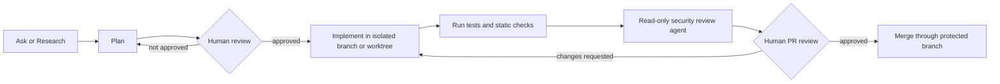

# AgentSecurity

Security guidance, diagrams, example custom agents, review playbooks, and enterprise governance templates for using GitHub Copilot, VS Code agents, Visual Studio agents, cloud/coding agents, and MCP safely.

Last reviewed: 2026-07-08

## Core idea

Agents are delegated development actors. Treat every agent like a junior developer with temporary access to your files, tools, terminal, identity, package managers, cloud CLIs, MCP servers, repository workflow, and external systems.

That means the control question is not whether the model seems trustworthy. The control question is:

> What can this agent read, change, execute, call, approve, exfiltrate, or cause someone else to merge?

## Enterprise decision principle

Do not approve “Copilot” as one undifferentiated capability.

| Capability | Default posture |
| --- | --- |
| Inline suggestions | Allow with baseline controls. |
| Standard Copilot Chat / Ask | Allow with baseline controls. |
| Edit mode | Pilot only. |
| VS Code agent mode | Controlled pilot only. |
| Visual Studio agent mode | Pilot only until control parity is proven. |
| Copilot cloud/coding agent | Low/medium-risk repo pilot only. |
| GitHub MCP Server | Read-only, narrow-toolset pilot first. |
| Third-party or local MCP | Block by default until admitted through a formal review process. |
| Write-capable MCP | Exception only. |

## What this repository contains

| Path | Purpose |
| --- | --- |
| `docs/01-vscode-copilot-agents-guide.md` | Practical guide to Ask, Plan, Agent mode, custom agents, prompt files, skills, MCP, handoffs, and subagents. |
| `docs/02-threat-model.md` | Threat model for local agents, cloud agents, MCP, terminal execution, prompt injection, and data exposure. |
| `docs/03-secure-configuration-baseline.md` | Secure workstation, VS Code, repository, MCP, and cloud-agent configuration baseline. |
| `docs/04-custom-agent-patterns.md` | Opinionated custom-agent patterns for security reviewers, threat modelers, implementers, and orchestrators. |
| `docs/05-playbooks.md` | Adoption, secure PR review, MCP onboarding, high-risk change, and incident-response playbooks. |
| `docs/06-resources.md` | Official documentation, video watchlist, research, and terminology. |
| `docs/07-checklists.md` | Practical checklists for approvals, MCP, terminal commands, merges, and agent configuration review. |
| `docs/08-enterprise-copilot-mcp-action-plan.md` | Phased enterprise action plan for Copilot, agent mode, cloud/coding agent, and MCP rollout. |
| `docs/09-enterprise-control-matrix.md` | Control matrix for GitHub, VS Code, Visual Studio, MCP, SDLC, endpoint, identity, and network controls. |
| `docs/10-mcp-server-admission-standard.md` | MCP server admission standard, risk classes, logging schema, and approval requirements. |
| `docs/11-red-team-validation-plan.md` | Red-team validation plan for prompt injection, terminal abuse, MCP exfiltration, and audit reconstruction. |
| `templates/` | Reusable intake templates for pilots, MCP server admission, exceptions, and red-team test cases. |
| `docs/diagrams.md` | Renderable Mermaid diagrams embedded in Markdown. |
| `diagrams/*.mmd` | Standalone Mermaid source files. |
| `.github/ISSUE_TEMPLATE/` | GitHub issue forms for MCP admission and Copilot/agent pilots. |
| `.github/pull_request_template.md` | PR template with agent/Copilot/MCP disclosure and validation fields. |
| `.github/agents/*.agent.md` | Example custom agents for security-oriented workflows. |
| `.github/prompts/*.prompt.md` | Reusable prompt files for threat modeling and secure review. |
| `.github/copilot-instructions.md` | Repository-level Copilot instructions. |
| `.vscode/settings.example.jsonc` | Example conservative local VS Code settings. |
| `SECURITY.md` | Security policy for contributions to this repository. |

## Security-first agent workflow

## Fast start

1. Read `docs/01-vscode-copilot-agents-guide.md` for the operating model.
2. Apply the local baseline in `docs/03-secure-configuration-baseline.md`.
3. Review `docs/08-enterprise-copilot-mcp-action-plan.md` before enterprise rollout.
4. Use `docs/09-enterprise-control-matrix.md` to decide allow, pilot, exception, or block.
5. Use `docs/10-mcp-server-admission-standard.md` before enabling any MCP server.
6. Run `docs/11-red-team-validation-plan.md` before expanding agentic or MCP use.
7. Use `docs/07-checklists.md` during agent sessions and reviews.

## Recommended default agent pattern

Use narrowly scoped agents rather than one powerful do-everything agent.

| Agent role | Tool posture | Recommended use |
| --- | --- | --- |
| Security Reviewer | Read/search only | Review diffs and code paths. No edits. No terminal. |
| Threat Modeler | Read/search only | Identify trust boundaries, assets, abuse cases, and assumptions. |
| Secure Planner | Read/search/web only | Produce an implementation plan and test strategy before code changes. |
| Secure Implementer | Read/search/edit/execute | Implement approved plans only. Use sparingly. |
| Orchestrator | Agent delegation only | Coordinate read-only specialists. Avoid mutation. |

## Non-negotiables

- Do not use broad tool access as a default.
- Do not use `tools: ['*']` unless the repository is disposable.
- Do not enable broad terminal auto-approval in untrusted repositories.
- Do not enable global auto-approval, bypass approvals, or autopilot-style behavior as an enterprise default.
- Do not let an agent mutate production infrastructure from a developer workstation.
- Do not treat content exclusion as a complete security boundary for agent mode, CLI, cloud/coding agent, or MCP-connected workflows.
- Do not let external content, issue text, PR comments, READMEs, web pages, build logs, terminal output, or MCP responses override the task you gave the agent.
- Do not let local stdio MCP servers run on corporate Windows workstations without explicit admission review and endpoint controls.
- Do not merge agent-authored code without human review and automated validation.

## Repository status

This is a guidance repository, not a product. The sample agents, prompts, settings, and templates are intentionally conservative and should be adapted to your local VS Code/Copilot/Visual Studio versions, enterprise policies, legal requirements, and risk tolerance.

## License

Add a license appropriate for your intended use before broad reuse or redistribution.
