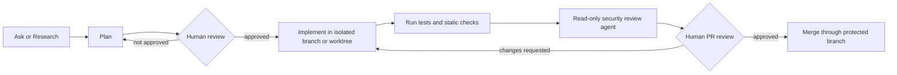

# AgentSecurity

Security guidance, diagrams, example custom agents, and review playbooks for using GitHub Copilot and VS Code agents safely.

Last reviewed: 2026-07-02

## Core idea

Agents are delegated development actors. Treat every agent like a junior developer with temporary access to your files, tools, terminal, identity, package managers, cloud CLIs, MCP servers, and repository workflow.

That means the control question is not whether the model seems trustworthy. The control question is:

> What can this agent read, change, execute, call, approve, exfiltrate, or cause someone else to merge?

## What this repository contains

| Path | Purpose |
| --- | --- |
| `docs/01-vscode-copilot-agents-guide.md` | Practical guide to Ask, Plan, Agent mode, custom agents, prompt files, skills, MCP, handoffs, and subagents. |
| `docs/02-threat-model.md` | Threat model for local agents, cloud agents, MCP, terminal execution, prompt injection, and data exposure. |
| `docs/03-secure-configuration-baseline.md` | Secure workstation, VS Code, repository, MCP, and cloud-agent configuration baseline. |
| `docs/04-custom-agent-patterns.md` | Opinionated custom-agent patterns for security reviewers, threat modelers, implementers, and orchestrators. |
| `docs/05-playbooks.md` | Adoption, secure PR review, MCP onboarding, high-risk change, and incident-response playbooks. |
| `docs/06-resources.md` | Official documentation, video watchlist, research, and terminology. |
| `docs/07-checklists.md` | Practical checklists for approvals, MCP, terminal commands, merges, and agent configuration review. |
| `docs/diagrams.md` | Renderable Mermaid diagrams embedded in Markdown. |
| `diagrams/*.mmd` | Standalone Mermaid source files. |
| `.github/agents/*.agent.md` | Example custom agents for security-oriented workflows. |
| `.github/prompts/*.prompt.md` | Reusable prompt files for threat modeling and secure review. |
| `.github/copilot-instructions.md` | Repository-level Copilot instructions. |
| `.vscode/settings.example.jsonc` | Example conservative local VS Code settings. |
| `SECURITY.md` | Security policy for contributions to this repository. |

## Security-first agent workflow

## Fast start

1. Read `docs/01-vscode-copilot-agents-guide.md` for the operating model.
2. Apply the local baseline in `docs/03-secure-configuration-baseline.md`.
3. Review `.github/agents/security-reviewer.agent.md` before enabling any write-capable agent.
4. Use `docs/07-checklists.md` during agent sessions.
5. Review `docs/02-threat-model.md` before allowing MCP, terminal execution, cloud CLIs, or cloud agents.

## Recommended default agent pattern

Use narrowly scoped agents rather than one powerful do-everything agent.

| Agent role | Tool posture | Recommended use |
| --- | --- | --- |
| Security Reviewer | Read/search only | Review diffs and code paths. No edits. No terminal. |
| Threat Modeler | Read/search only | Identify trust boundaries, assets, abuse cases, and assumptions. |
| Secure Planner | Read/search/web only | Produce an implementation plan and test strategy before code changes. |
| Secure Implementer | Read/search/edit/execute | Implement approved plans only. Use sparingly. |
| Orchestrator | Agent delegation only | Coordinate read-only specialists. Avoid mutation. |

## Non-negotiables

- Do not use broad tool access as a default.
- Do not use `tools: ['*']` unless the repository is disposable.
- Do not enable broad terminal auto-approval in untrusted repositories.
- Do not let an agent mutate production infrastructure from a developer workstation.
- Do not treat content exclusion as a security boundary for agent mode.
- Do not let external content, issue text, PR comments, READMEs, web pages, or tool output override the task you gave the agent.
- Do not merge agent-authored code without human review and automated validation.

## Repository status

This is a guidance repository, not a product. The sample agents and prompts are intentionally conservative and should be adapted to your local VS Code/Copilot version, enterprise policies, and risk tolerance.

## License

Add a license appropriate for your intended use before broad reuse or redistribution.
