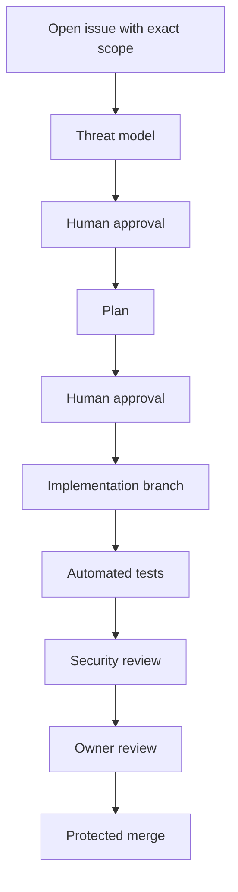

# Agent Security Playbooks

Last reviewed: 2026-07-02

## 1. Thirty-day adoption playbook

### Week 1: Observe and constrain

- inventory who is using agents and where
- identify local, cloud, and CLI agent surfaces
- document MCP servers and extension-provided tools
- disable broad terminal auto-approval
- publish the secure baseline
- require agent-authored changes to go through PR review

Deliverable: baseline policy and inventory.

### Week 2: Create safe defaults

- add read-only Security Reviewer and Threat Modeler agents
- add prompt files for secure review and threat modeling
- add CODEOWNERS for `.github/agents`, `.github/prompts`, workflows, and IaC
- add sensitive file patterns to review rules
- create training examples for prompt injection

Deliverable: safe agents and review guardrails.

### Week 3: Introduce controlled implementation

- define when write-capable agents are allowed
- require plan approval before implementation
- require tests and summary output
- prohibit production cloud mutation from local agents
- pilot on low-risk repos first

Deliverable: secure implementation workflow.

### Week 4: Measure and harden

- review agent-authored PRs for recurring issues
- tune prompts and agent instructions
- add CI linting for dangerous agent config
- formalize MCP onboarding
- create incident response checklist

Deliverable: operationalized agent security program.

## 2. Daily developer workflow

```text
1. Ask: understand code path.
2. Plan: get proposed change and tests.
3. Review: approve or narrow scope.
4. Implement: allow edits only in branch/worktree.
5. Validate: run tests and checks.
6. Review: use read-only security reviewer.
7. PR: require human review and status checks.
```

Prompt template:

```text
Use Plan mode first. Do not edit files. Produce a plan with files likely affected, security-sensitive areas, tests, and rollback notes. Wait for approval before implementation.
```

## 3. Secure PR review playbook

Use when reviewing agent-authored or agent-assisted code.

1. Confirm the requested task.
2. Compare requested scope to actual diff.
3. Identify security-sensitive files changed.
4. Check authn, authz, input validation, output encoding, secrets, logging, crypto, and data access.
5. Review new dependencies and lockfiles.
6. Ensure tests include negative and abuse cases.
7. Run or inspect automated checks.
8. Look for generated code that is hard to review.
9. Reject unexplained CI/CD, IaC, or secret changes.
10. Record residual risk.

Security Reviewer prompt:

```text
Review this PR as untrusted agent-authored code. Identify scope drift, security-sensitive file changes, missing negative tests, dependency risk, and any changes that weaken CI/CD or policy. Do not edit files.
```

## 4. MCP onboarding playbook

Use before enabling a new MCP server.

1. Identify owner and business purpose.
2. Review source, package, image, or internal build.
3. Pin version or digest.
4. List all exposed tools.
5. Classify each tool as read, write, execute, admin, or unknown.
6. Map each tool to approved agents.
7. Create least-privilege credentials.
8. Confirm logging and audit access.
9. Test with hostile prompts.
10. Add review date and owner.

Reject an MCP server when:

- ownership is unclear
- version is floating
- tools are poorly named
- write tools cannot be disabled
- credentials require broad admin rights
- tool calls are not logged
- source cannot be reviewed and risk is high

## 5. High-risk change playbook

Use this for auth, crypto, secrets, CI/CD, deployment, cloud, database migration, or IaC changes.

Required workflow:



Controls:

- no production credentials in local agent session
- no direct apply/deploy from workstation
- explicit rollback plan
- independent human reviewer
- required checks before merge
- staged rollout where applicable

## 6. Incident response playbook

Trigger when an agent may have executed untrusted code, exposed secrets, changed sensitive files, or invoked an unexpected MCP/cloud action.

Immediate actions:

1. Stop the agent session.
2. Preserve chat, terminal, and tool logs.
3. Capture git diff and command history.
4. Revoke or rotate exposed credentials.
5. Disable suspect MCP server or extension.
6. Revert unreviewed changes.
7. Review network egress if available.
8. Search for persistence or unexpected files.
9. Notify repo/security owners.
10. Document root cause and control gap.

Questions to answer:

- What instruction or context caused the action?
- Which tools were available?
- Which credentials were reachable?
- What files changed?
- What external systems were touched?
- Did branch protection or review controls catch it?
- Which baseline setting would have prevented or reduced impact?

## 7. Training exercise

Create a disposable repo with:

```text
README prompt injection
malicious test fixture
fake package install instruction
agent config with wildcard tools
MCP server with suspicious write tool names
```

Have engineers run only read-only agents first. Then compare how different approval and sandbox settings change the outcome.

Do not run the exercise in a real repository or with real credentials.
