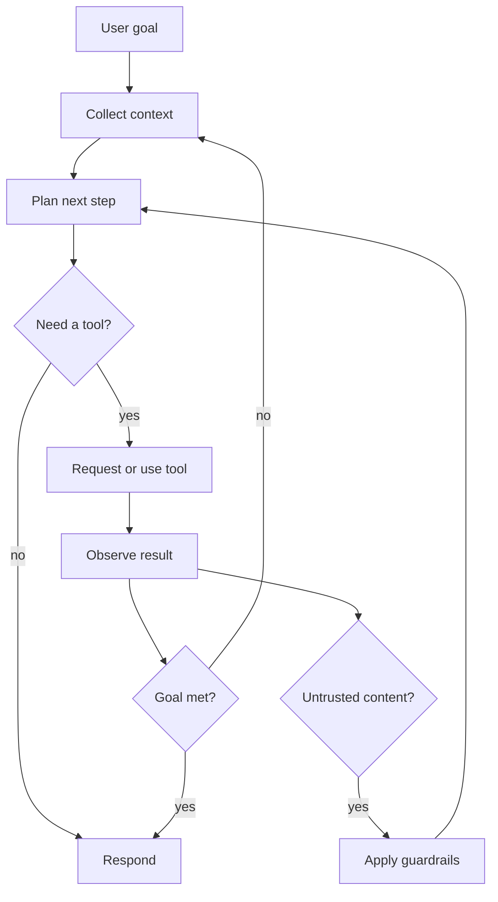
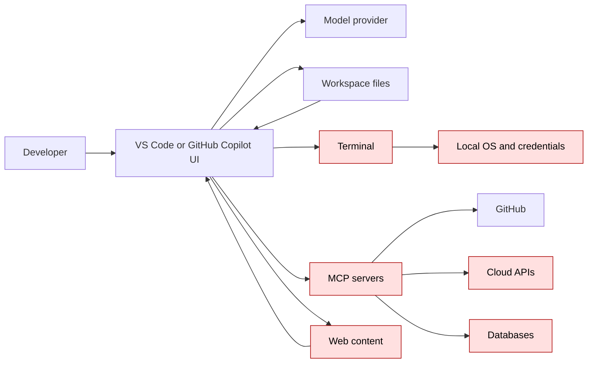
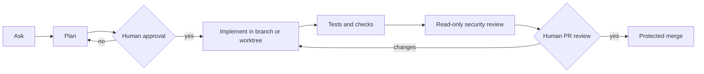
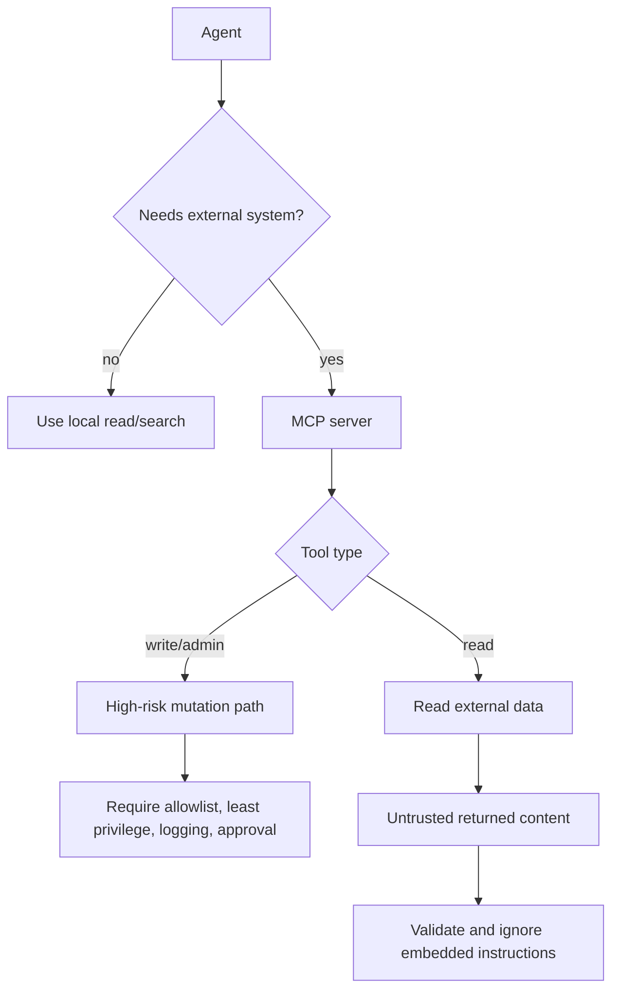
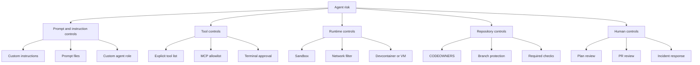

# Diagrams

Last reviewed: 2026-07-02

These diagrams are written in Mermaid so they render in GitHub Markdown and can be edited as text. Standalone source files are in `diagrams/`.

## 1. Agent loop

## 2. Trust boundaries

## 3. Secure workflow

## 4. MCP risk flow

## 5. Control map

